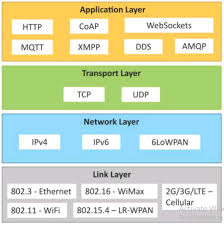

<h3>Ques1. What is a protocol stack, and how is it used in web development?</h3>

<h3>Answers:</h3>
Protocol stacks are a layered collection of protocols that work together to provide communication services. Each protocol in the stack is responsible for a specific task, and by layering them, we can create a more robust and reliable system.

There are five layers in the internet protocol stack:

1.Application Layer
2.Transport Layer
3.Network Layer
4.Link Layer
5.Physical Layer

1. <h3>Application Layer :</h3> This layer is responsible for communication between applications running on two different end systems. A message or data transferred from one end is readable for the corresponding application on the other end. These applications include web browsers, email clients, etc.At the application layer, the data being transferred is called a message.
   The protocols used at the application layer include:

- Hypertext Transfer Protocol (HTTP): for transferring HTML web documents
- File Transfer Protocol (FTP): for transferring files
- Simple Mail Transfer Protocol (SMTP): for transferring e-mail messages
- Domain Name System (DNS): for translation of human-friendly domain names into IP addresses

2. <h3>Transport Layer :</h3> On the sending end, the transport layer is responsible for collecting the application layer message from the relevant end-point and transferring it to the network layer to be communicated over the network. The receiving end collects the message from the network layer and passes it on to the relevant end-point where the application layer can access that message.

These end-points are called sockets. The transport layer uses a unique identifier called a port number to identify the correct socket or application.

The message received from the application layer might be broken into chunks at this layer.

The two important protocols used in the transport layer are:
Transmission Control Protocol (TCP): for reliable and connection-oriented data transfer
User Datagram Protocol (UDP): for fast, unreliable, and connection-less data transfer

3. <h3>Network Layer :</h3> The network layer is responsible for transferring data from one system to another on the network. The transport layer passes a segment and the destination address to the network layer. Then, it is the responsibility of the network layer to transfer the data to the destination end-system over the network. This layer also takes care of the routing of data on intermediate routers.

The main protocol used at the network layer to transfer data is Internet Protocol (IP). This protocol makes use of IP addresses to identify each system connected to the internet. The two versions of IP protocol are as follows:
IPv4
IPv6

4. <h3>Link Layer :</h3> When a packet is being transferred over the internet, several intermediate devices are between the two end systems. These devices may be routers, switches, or other computers. The link layer is responsible for communication between one device and its immediate neighbor.

The protocols and methods used for one link might differ from the protocol used in the next immediate link, even if the destination and data packet remain the same.
The link-layer is mostly implemented in the network adapter/network interface card (NIC), and technologies like ethernet, Wi-Fi, token ring, etc., are associated with the link layer.

5. <h3>Physical layer :</h3> The physical layer is responsible for breaking the data frame into bits, converting it into a form that can be transmitted over the physical communication line, and transferring it. This form could be light pulses (fiber-optic), radio waves.
   
